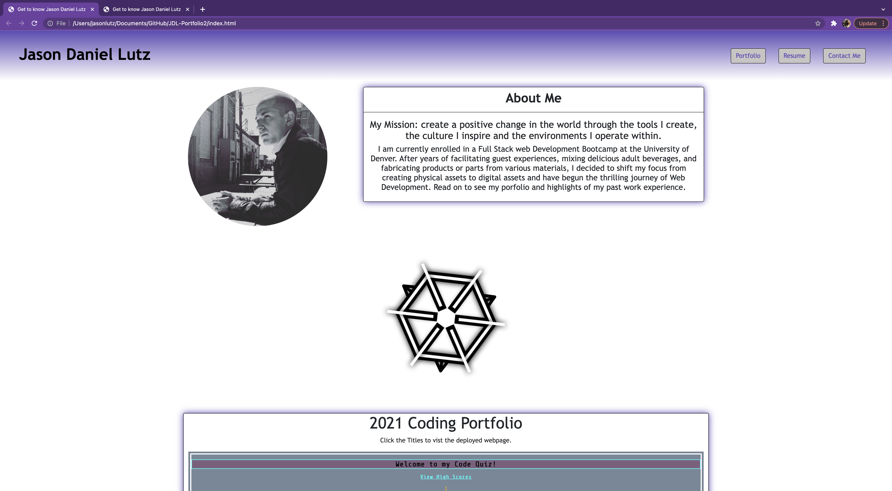

# JDL-Portfolio2

[Link to Deployed Page](https://lutzjason92.github.io/JDLPortfolio2.0/)

## Professional Portfolio

This website, which is my online portfolio, will be updated periodically as class progresses.

Your Portfolio should include:

[x] 1. Display your contact information. If you don't want to share your personal email or phone number, use a separate email that you will only use for coding, also known as a developer email, and/or a call forwarding service, such as [Google Voice](https://voice.google.com/).

[x] 2. Have links to your GitHub profile and LinkedIn profile

[x] 3. Have a link to a downloadable PDF of your resume

[x]4. Display at least 2 examples of student work from either deployed projects or homeworks. For each project, make sure you have the following:

- Project title

- Link to the deployed version

- Link to the GitHub repository

- Screenshot of the deployed application

[x] 5. Have a polished, mobile-responsive user interface.

### Design

Unfortunately, this is where it gets a little bit subjective. Your site should look
"polished." Here are a few guidelines on what that means:

- Mobile-first design

- Choose a color palette for your site so it doesn't just look like the default bootstrap theme or an unstyled HTML site.

- Make sure the font size is large enough to read, and that the colors don't cause eye strain.

[Updated Portfolio](https://lutzjason92.github.io/JDL-Portfolio2/)

2. [Updated GitHub Profile](https://github.com/LutzJason92)

3. [Updated Resume](https://drive.google.com/file/d/1G0Gct3I7aLS30GZ6KtgGqgvqXxTA0DSe/view?usp=sharing)

4. [Updated LinkedIn](https://www.linkedin.com/in/jason-lutz-a0710a191/)
